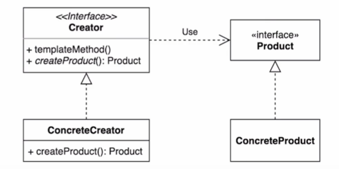

# 팩토리 메소드 (Factory method) 패턴
구체적으로 어떤 인스턴스를 만들지는 서브 클래스가 정한다

* 다향한 구현체 (Product)가 있고, 그중에서 특정한 구현체를 만들 수 있는 다양한 팩토리(Creator)를 제공할 수 있다

* 팩토리 메소드 패턴을 적용시 장점
    * 확장에 열려있고 변경에 닫혀있는 객체지향 원칙을 적용 가능
    * 기존에 있는 인스턴스를 만드는 과정이 담긴 로직을 변경하지 않고 같은류의 새로운 인스턴스를 만들 때 다른 방법으로 확장이 가능하다 
        * 프로덕트와 크리에이터간의 커플링을 루즈하게 가져가기 때문 (느슨한 결합 - 프로덕트와 크리에이터간의 관계를 느슨하게 가져간다)
      

* 팩토리 메소드 패턴을 적용시 장점
    * 각자의 역할을 나누다 보니 클래스가 늘어난다

* OCP : 확장에 열려있고 변경에 닫혀있는 객체 지향 원칙
    * 변경에 닫혀있다는 것은 기존 코드를 변경하지 않는 것
    * 즉 기존 코드를 변경하지 않고 확장을 가능하게 하는 것

* 자바 8에 추가된 default 메소드
    * interface 에서 기본 구현체를 만들 수 있는 메소드
    * 해당 interface 를 구현하는 클래스, 상속 받는 클래스에서 사용 가능하다
    * 따라서 추상 클래스에서 하던 대부분의 일을 interface 에서 사용 가능하다
        * java8 에서는 추상 클래스 보다 interface 를 더 많이 사용하니 해당 메소드를 많이 활용해보자