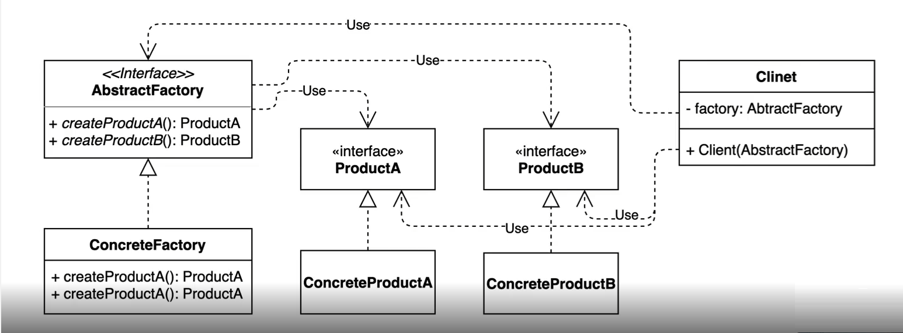
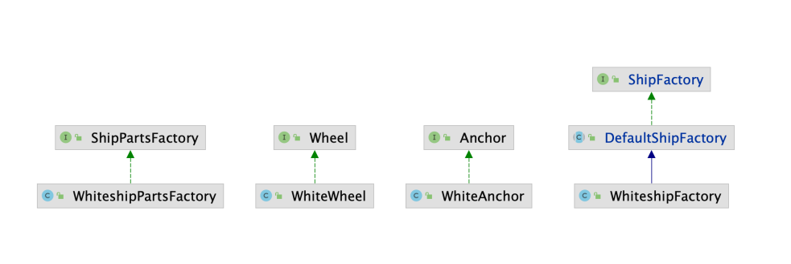

# 추상 팩토리 (Abstract factory) 패턴
서로 관련있는 여러 객체를 만들어주는 인터페이스

* 구체적으로 어떤 클래스의 인스턴스를(concrete product)를 사용하는지 감출 수 있다

## 추상 팩토리 (Abstract factory) 패턴 구현 방법
* 클라이언트 코드에서 구체적인 클래스의 의존성을 제거한다

## 추상 팩토리 패턴과 팩토리 메소드 패턴의 차이점
* 모양과 효과는 비슷하다
  * 둘 다 구체적인 객체 생성 과정을 추상화한 인터페이스를 제공한다
* 관점이 다르다
  * 팩토리 메소드 패턴은 "팩토리를 구현하는 방법 (inheritance)"에 초점을 둔다
  * 추상 팩토리 패턴은 "팩토리를 사용하는 방법 (composition)"에 초점을 둔다
* 목적이 다르다
  * 팩토리 메소드 패턴은 구체적인 객체 생성 과정을 하위 또는 구체적인 클래스로 옮기는 것이 목적
  * 추상 팩토리 패턴은 관련있는 여러 객체를 구체적인 클래스에 의존하지 않고 만들수 있게 해주는 것이 목적

### 팩토리 메소드(Factory method) 패턴
* 객체를 만드는 과정에 조금 더 집중이 되어 있다
* 구체적으로 어떤 인스턴스를 만들지는 서브 클래스가 정의한다
* 다양한 구현체(Product)가 있고, 그 중에서 특정한 구현체를 만들 수 있는 다양한 팩토리(Creator)를 제공할 수 있다

