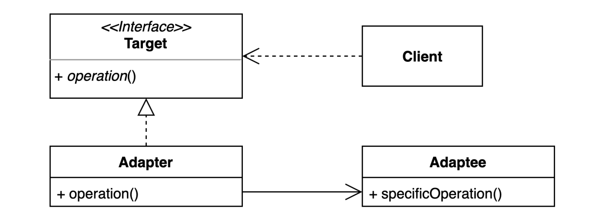
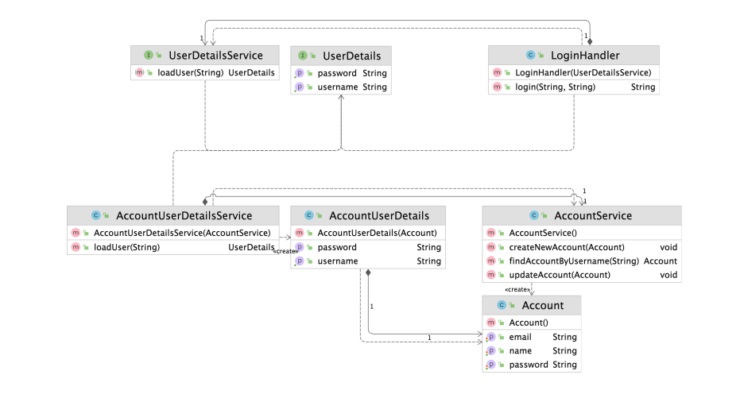

# 어댑터 (Adapter) 패턴
기존 코드를 클라이언트가 사용하는 인터페이스의 구현체로 바꿔주는 패턴

* 클라이언트가 사용하는 인터페이스를 따르지 않는 기존 코드를 재사용할 수 있게 해준다

### 어댑터 (Adapter) 패턴 구현 방법

### 장점
* 기존 코드를 변경하지 않고 원하는 인터페이스 구현체를 만들어 재사용할 수 있다
* 기존 코드가 하던 일과 특정 인터페이스 구현체로 변환하는 작업을 각기 다른 클래스로 분리하여 관리할 수 있다

### 단점
* 새 클래스가 생겨 복잡도가 증가할 수 있다.
    * 경우에 따라서 기존 코드가 해당 인터페이스를 구현하도록 수정하는것이 좋은 선택이 될 수도 있다

### 실무에서 어떻게 쓰이나?
* 자바
  * java.util.Arrays#asList(T…)
  * java.util.Collections#list(Enumeration)
  * java.util.Collections#enumeration()
  * java.io.InputStreamReader(InputStream)
  * java.io.OutputStreamWriter(OutputStream)
* 스프링
  * HandlerAdapter: 우리가 작성하는 다양한 형태의 핸들러 코드를 스프링 MVC가 실행할 수 있는 형태로 변환해주는 어댑터용 인터페이스