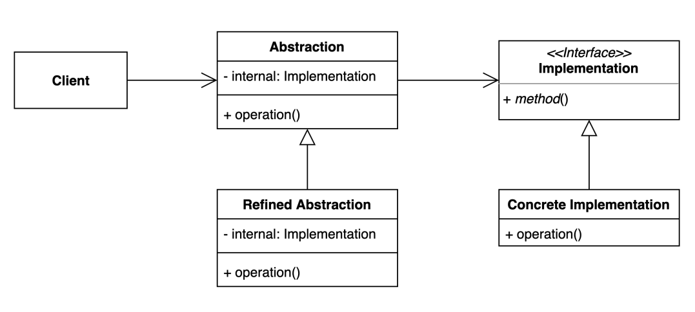
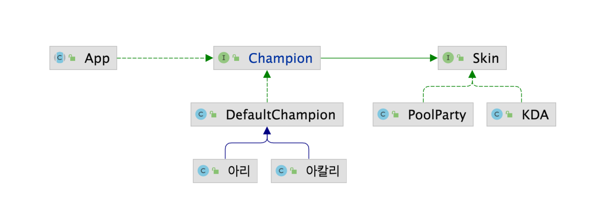

# 브릿지 (Bridge) 패턴
추상적인 것과 구체적인 것을 분리하여 연결하는 패턴

* 하나의 계층 구조일 때 보다 각기 나누었을 때 독립적인 계층 구조로 발전 시킬 수 있다

### 브릿지 (Bridge) 패턴 구현 방법

### 장점
* 추상적인 코드를 구체적인 변경 없이도 독립적으로 확장할 수 있다
* 추상적인 코드와 구체적인 코드를 분리하여 사용할 수 있다

### 단점
* 계층 구조가 늘어나 복잡도가 증가할 수 있다

### 실무에서 어떻게 쓰이나?
* JAVA
    * JDBC API, DriverManager 와 Driver
    * SLF4J, 로깅 퍼사드와 로거
* Spring
    * Portable Service Abstraction 