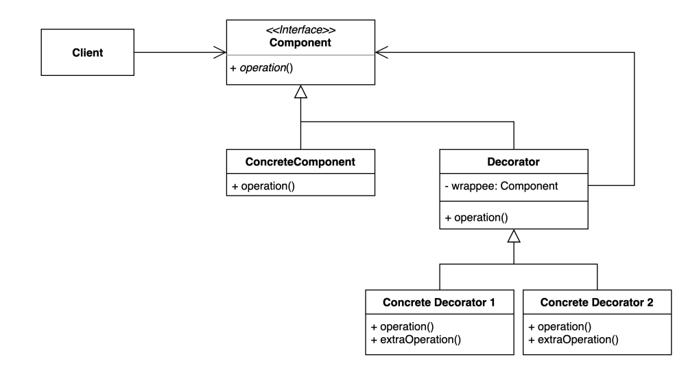
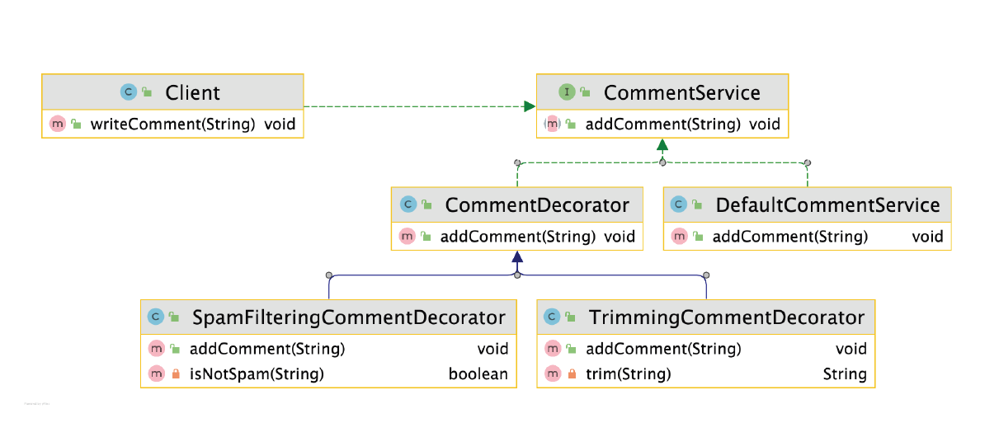

# 데코레이터 (Decorator) 패턴
기존 코드를 변경하지 않고 부가 기능을 추가하는 패턴

* 상속이 아닌 위임을 사용해서 보다 유연하게(런타임에)부가 기능을 추가하는 것도 가능하다

### 데코레이터 패턴 구현 방법

* 장점
  * 새로운 클래스를 만들지 않고 기존 기능을 조합할 수 있다
  * 컴파일 타임이 아닌 런타임에 동적으로 기능을 변경할 수 있다
  * 데코레이터들은 본연의 일만 하면 되기 때문에 단일 책임의 원칙을 지킬 수 있다

* 단점
  * 데코레이터를 조합하는 코드가 복잡할 수 있다